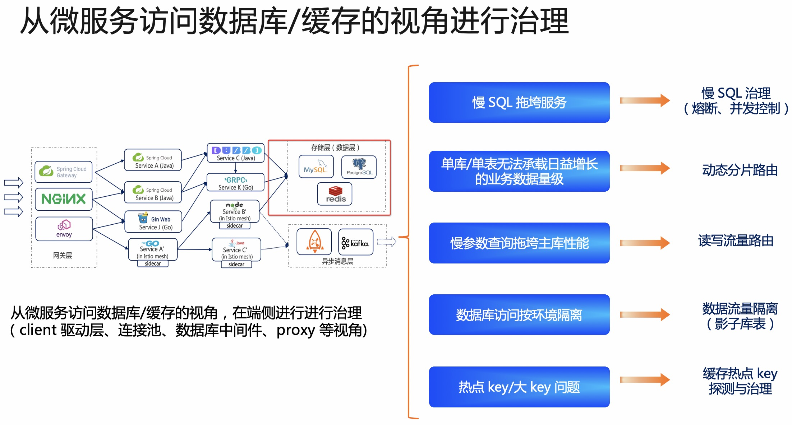
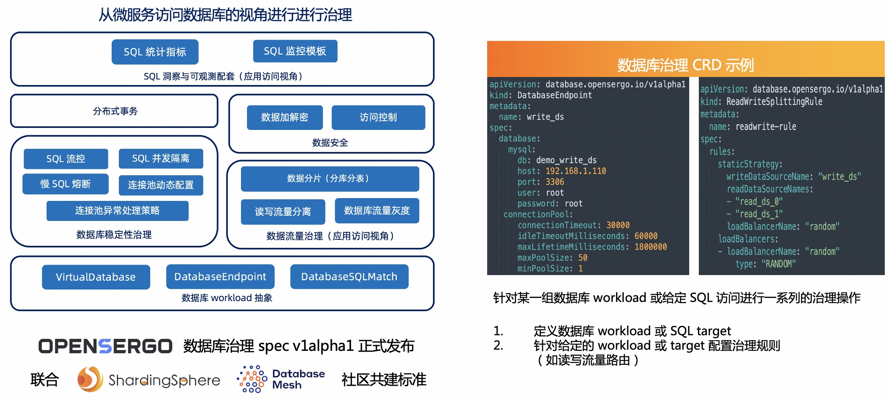

## 为什么需要微服务治理与 OpenSergo？

在经典微服务架构中，我们通常将服务调用中各角色划分为三部分：服务提供者、服务消费者、注册中心。经典的微服务架构可以解决微服务能调通、可以运行起来的问题。随着分布式服务架构的不断演进、业务规模的扩张，诸多复杂的稳定性与易用性问题显现出来，这时候就需要一些手段来针对日益复杂的微服务架构进行“治理”。微服务治理就是通过流量治理、服务容错、安全治理等技术手段来减少甚至避免发布和管理大规模应用过程中遇到的稳定性问题，对微服务领域中的各个组件进行治理。服务提供者、消费者、注册中心、服务治理，构成现代微服务架构中重要的几环。


微服务治理是把微服务做稳做好的关键一环。但是，业界微服务治理存在概念不统一、配置形式不统一、能力不统一、多框架统一管控较为复杂等问题。比如我们希望配置流量灰度规则，在 Spring Cloud Alibaba 中可能需要通过 YAML 方式配置，在 Dubbo 中需要通过另一种配置格式进行配置，在 Istio 体系内中可能又需要通过 Istio CRD 的方式进行配置。**不同框架治理配置方式的不一致使得微服务统一治理管控的复杂度相当高**。另外，业界的各种框架支持的服务治理能力都不统一，且通常比较基础，很多时候无法覆盖生产级的场景。


基于上面这些痛点，阿里巴巴在2022年1月开始和 bilibili、字节等企业讨论服务治理如何规范化和更加普及，从而共同发起了 [OpenSergo 项目](https://opensergo.io/zh-cn/)。**OpenSergo 是开放通用的，覆盖微服务及上下游关联组件的微服务治理项目，从微服务的角度出发，涵盖流量治理、服务容错、服务元信息治理、安全治理等关键治理领域，提供一系列的治理能力与标准、生态适配与最佳实践，支持 Java, Go, Rust 等多语言生态**。OpenSergo 的最大特点就是以统一的一套配置/DSL/协议定义服务治理规则，面向多语言异构化架构，覆盖微服务框架及上下游关联组件。无论微服务的语言是 Java, Go, Node.js 还是其它语言，无论是标准微服务还是 Mesh 接入，从网关到微服务调用，再到微服务对数据库/缓存的访问，开发者都可以通过同一套 OpenSergo CRD 标准配置进行统一的治理管控，而无需关注各框架、语言的差异点，降低异构化、全链路微服务治理管控的复杂度。


OpenSergo 提供 Java、Go 等多语言的 SDK，各个框架生态可以非常方便地通过 OpenSergo SDK 来对接 OpenSergo 标准配置，接入到 OpenSergo 生态中，通过 OpenSergo 控制平面 (Control Plane) 统一管理服务治理规则。

## 微服务视角的数据库治理是保障服务稳定性的关键一环

提到“微服务治理”，很多开发者会首先想到针对微服务之间的调用流量进行治理，但很多时候大家容易忽视掉微服务访问存储与其它中间件的这部分流量。在一个真实的业务生产环境中，流量首先先进入入口网关（如 Nginx、Envoy），再流转到后端 Web Server，再流转到微服务之间的 RPC 调用，再流转到针对数据库、缓存、消息等存储/中间件的访问。在这样一个全链路的架构中，仅仅关注微服务之间的调用是不够的，我们需要针对链路中的每一环分别进行针对性的治理。其中微服务对数据库的访问是非常普遍的，也是容易出现稳定性问题的一环。比如：

* 某个应用某类报表 SQL 访问量非常大，且查询非常消耗性能，把数据库 CPU 打满
* 慢 SQL 访问非常多，占满连接池/业务线程池，导致服务无法处理正常请求，甚至导致级联雪崩
* 连接池参数配置不合理，导致大量 SQL 写操作时无法有效获取连接，业务大量报错
* 数据库访问需要按环境标进行隔离，比如灰度数据写入到灰度表中



对于大多数的后端应用来讲，系统性能扩展的瓶颈主要受限于数据库。尤其在微服务的环境下，数据库的性能治理问题往往也是团队优先级最高的几类工作之一，数据库治理自然也成为微服务治理中必不可少的一环。我们期望开发者可以结合数据库治理能力，来保障微服务访问数据库的稳定性（保护微服务自身不被拖垮），同时也保障数据库的稳定性。

## OpenSergo 联合 ShardingSphere 社区共建数据库治理标准

基于以上背景，OpenSergo 社区期望结合企业与开源社区的经验，抽出一套通用的、从微服务视角出发的数据库治理标准规范。[ShardingSphere](https://shardingsphere.apache.org/) 作为数据库治理领域的标杆项目，沉淀了非常丰富的最佳实践与技术经验，可以很好地为 OpenSergo 补充数据库治理领域的空缺。**因此 OpenSergo 社区联合 ShardingSphere 社区共建微服务视角的数据库治理标准，扩充治理边界，让社区能够以标准化的方式针对不同数据层框架与流量进行统一治理管控，共同推进治理领域技术与生态演进。**



对于此次 OpenSergo 与 ShardingSphere 社区之间的合作，双方社区负责人都对此次合作表达了自己的观点：

> **Apache ShardingSphere PMC Chair 张亮**: 在微服务领域，服务间的交互与协作已日臻完善，而服务对数据库的访问却依然缺失行之有效的标准。ShardingSphere 自开源以来，一直持续不断的践行着“连接、增强、可插拔”的设计哲学。其中，“连接”则是希望提供标准化的协议和接口，打破开发语言访问异构数据库的壁垒。OpenSergo 提出了微服务治理的标准，并首次将数据库的访问放在了标准中，非常具备前瞻性。作为访问数据库重要入口的微服务，我非常希望 ShardingSphere 和 OpenSergo 共建标准。


> **OpenSergo && Sentinel 社区负责人 赵奕豪（宿何）**：在微服务治理领域中，除了微服务本身的治理之外，针对数据库访问的治理也是保障业务可靠性与连续性的关键一环。ShardingSphere 作为数据库治理领域的标杆项目，沉淀了非常丰富的最佳实践与技术经验，可以很好地为 OpenSergo 补充数据库治理领域的空缺。因此我们联合 ShardingSphere 社区共建微服务视角的数据库治理标准，扩充治理边界，期待让社区能够以标准化的方式针对不同数据层框架与流量进行统一治理管控，共同推进治理领域技术与生态演进。


OpenSergo 微服务视角的数据库治理标准主要包括以下几部分：

### 对数据库 workload 及访问对象的抽象

在治理规则中，我们通常需要指定规则作用的数据库实例（或实例组），或者满足的 SQL 条件。针对这一部分，我们在 OpenSergo 数据库治理标准中针对数据库 target workload 及访问对象进行了一些抽象。

- **虚拟数据库 (VirtualDatabase)**：在数据库治理中，不管是读写分离、分库分表、影子库，还是加密、审计和访问控制等，都需要作用在一个具体的数据库之上。在这里将这样的一个逻辑的数据库称为虚拟数据库，即 VirtualDatabase。VirtualDatabase 在应用看来是一组特定的数据库访问信息，并通过绑定特定的治理策略实现相应的治理能力
- **数据库端点 (DatabaseEndpoint)**：在数据库治理中，通过 VirtualDatabase 向应用声明了可以使用的逻辑数据库，而数据的真实存储则依赖于这样的一个物理的数据库，这里称为数据库访问端点，即 DatabaseEndpoint。DatabaseEndpoint 对应用无感知，它只能被 VirtualDatabase 通过特定治理策略所绑定然后连接和使用。

针对访问对象的条件抽象：

- **数据库访问对象 (DatabaseAccessTarget)**：定义一组匹配条件，如针对某个实例/库/表的访问、针对某类 SQL 性质（读/写操作）、按 SQL pattern 匹配、按 SQL 参数匹配等。将 DatabaseAccessTarget 与具体的治理规则结合，我们可以实现细粒度的数据库流量治理。

### 流量治理在数据库访问的体现

在微服务对数据库的访问中，流量路由、流量隔离、流控降级与容错等相关流量治理能力是数据库治理中非常重要的一块。

在流控降级与容错领域，我们复用了 OpenSergo 流控降级与容错标准。OpenSergo 流控降级与容错 spec 定义了三要素：Target（针对怎样的流量）、Strategy（对应怎样的流量治理策略）、FallbackAction（触发策略之后的行为）。在针对数据库访问的治理中，我们将流量条件抽象为 `DatabaseAccessTarget`，结合 OpenSergo 自有的流控、并发控制、熔断等策略，即可以实现细粒度的流控降级与容错。


同时数据库流量治理体系中还有一些关键的、数据库领域特有的治理能力：

- **读写流量路由 (ReadWriteSplitting)**：读写分离是常用的数据库扩展方式之一，主库用于事务性的读写操作，从库主要用于查询等操作。读写流量路由规则可以指定将读 SQL 路由到读库，事务性的读写操作路由到主库。
- **分库分表路由 (Sharding)**：数据分片路由是基于数据属性一种扩展策略，对数据属性进行计算后将请求路由到特定的数据后端，目前分为分片键分片和自动分片。其中分片键分片中需要指明需要分片的表、列、以及进行分片的算法。
- **数据流量隔离 (影子库表 Shadow)**：影子库表可以帮助在灰度环境或者测试环境中，接收灰度流量或者测试数据请求，结合影子算法等灵活配置多种路由方式。
- **数据加密 (Encryption)**：企业往往因为安全审计和合规的要求，需要对数据存储提供多种安全加固措施，比如数据加密。 数据加密通过对用户输入的 SQL 进行解析，并依据用户提供的加密规则对 SQL 进行改写，从而实现对原文数据进行加密，并将原文数据（可选）及密文数据同时存储到底层数据库。在用户查询数据时，它仅从数据库中取出密文数据，并对其解密，最终将解密后的原始数据返回给用户。


以下是一个读写流量路由规则的示例：

```yaml
# 虚拟数据库配置
apiVersion: database.opensergo.io/v1alpha1
kind: VirtualDatabase
metadata:
  name: readwrite_splitting_db
spec:
  services:
  - name: readwrite_splitting_db
    databaseMySQL:
      db: readwrite_splitting_db
      host: localhost
      port: 3306
      user: root
      password: root
    readWriteSplitting: "readwrite"  # 声明所需要的读写分离策略
---
# 写数据源的数据库端点配置
apiVersion: database.opensergo.io/v1alpha1
kind: DatabaseEndpoint
metadata:
  name: write_ds
spec:
  database:
    MySQL:                 # 声明后端数据源的类型及相关信息
      url: jdbc:mysql://192.168.1.110:3306/demo_write_ds?serverTimezone=UTC&useSSL=false
      username: root
      password: root
      connectionTimeout: 30000
      idleTimeoutMilliseconds: 60000
      maxLifetimeMilliseconds: 1800000
      maxPoolSize: 50
      minPoolSize: 1
---
# 第一个读数据源的数据库端点配置
apiVersion: database.opensergo.io/v1alpha1
kind: DatabaseEndpoint
metadata:
  name: read_ds_0
spec:
  database:
    MySQL:                 # 声明后端数据源的类型及相关信息
      url: jdbc:mysql://192.168.1.110:3306/demo_read_ds_0?serverTimezone=UTC&useSSL=false
      username: root
      password: root
      connectionTimeout: 30000
      idleTimeoutMilliseconds: 60000
      maxLifetimeMilliseconds: 1800000
      maxPoolSize: 50
      minPoolSize: 1      
---
# 第二个读数据源的数据库端点配置
apiVersion: database.opensergo.io/v1alpha1
kind: DatabaseEndpoint
metadata:
  name: read_ds_1
spec:
  database:
    MySQL:                              # 声明后端数据源的类型及相关信息
      url: jdbc:mysql://192.168.1.110:3306/demo_read_ds_1?serverTimezone=UTC&useSSL=false
      username: root
      password: root
      connectionTimeout: 30000
      idleTimeoutMilliseconds: 60000
      maxLifetimeMilliseconds: 1800000
      maxPoolSize: 50
      minPoolSize: 1
---
# 静态读写分离配置
apiVersion: database.opensergo.io/v1alpha1
kind: ReadWriteSplitting
metadata:
  name: readwrite
spec:
  rules:
    staticStrategy:
      writeDataSourceName: "write_ds"
      readDataSourceNames: 
      - "read_ds_0"
      - "read_ds_1"
      loadBalancerName: "random"
    loadBalancers:
    - loadBalancerName: "random"
      type: "RANDOM"
```

以下是一个针对某个 SQL 进行并发控制的示例。这个规则会针对 foo 应用针对 `SELECT * FROM users WHERE id = ?` 的 SQL 访问进行并发控制，单机并发数不超过 8。

```yaml
apiVersion: traffic.opensergo.io/v1alpha1
kind: DatabaseAccessTarget
metadata:
  name: target-foo-user-select-sql
spec:
  sqlMatch:
    - exactMatch: "SELECT * FROM users WHERE id = ?"
---
apiVersion: fault-tolerance.opensergo.io/v1alpha1
kind: ConcurrencyLimitStrategy
metadata:
  name: concurrency-limit-foo
spec:
  maxConcurrency: 8
  limitMode: 'Local'
---
apiVersion: fault-tolerance.opensergo.io/v1alpha1
kind: FaultToleranceRule
metadata:
  name: my-sql-conc-limit-rule
spec:
  selector:
    app: foo
  targets:
    - targetRef: target-foo-user-select-sql
  strategies: 
    - name: concurrency-limit-foo
```

### 其它数据库治理能力

- **数据库发现 (DatabaseDiscovery)**：数据库自动发现指的是根据数据库高可用配置，通过探测的方式感知数据源状态变化，并对流量策略做出相应的调整。比如后端数据源为 MySQL MGR，那么可以配置数据库发现类型为 MYSQL.MGR，指定 group-name，并配置相应的探测心跳节律。
- **分布式事务配置 (DistributedTransaction)**：声明分布式事务相关的配置，目前支持声明事务的类型。

## 展望

微服务视角的数据库治理是保障微服务稳定性的重要一环。OpenSergo 社区将持续与 ShardingSphere 及 Database Mesh 社区进行合作，不断完善与丰富数据库治理标准及场景。接下来社区会开展 ShardingSphere 与 OpenSergo 的集成工作，将数据库治理 spec 落地到社区实现。

微服务治理是微服务改造深入到一定阶段之后的必经之路，是将微服务做稳做好的关键。OpenSergo 社区持续与 ShardingSphere、Database Mesh、CloudWeGo、Kratos、Spring Cloud Alibaba、Dubbo 等社区共同建设 OpenSergo 微服务治理标准，将企业与社区中微服务治理的场景与最佳实践共同提取成标准规范，也欢迎更多社区与企业一起参与 OpenSergo 微服务治理标准的共建。

OpenSergo 社区现在处于高速发展阶段，从微服务治理标准定义，到 Control Plane 的实现，再到 Java/Go/C++/Rust 等多语言 SDK 与治理功能的实现，再到各个微服务生态的整合与落地，都还有大量的演进工作，欢迎社区一起参与标准完善与代码贡献。

**OpenSergo 开源贡献小组正在火热招募贡献者**。如果您有时间，有热情，有意愿，欢迎联系社区加入开源贡献小组，一起共同完善 OpenSergo 和 Sentinel，一起主导微服务治理技术与标准演进。Now let's start hacking!

欢迎关注 OpenSergo 社区微信公众号，了解微服务治理社区最新动态：OpenSergo
